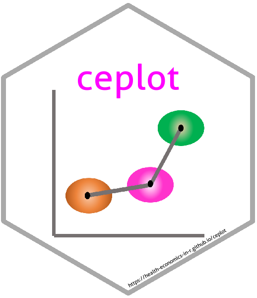

---
output:
  github_document:
    pandoc_args: --webtex
---

<!-- README.md is generated from README.Rmd. Please edit that file -->

```{r setup, include = FALSE}
knitr::opts_chunk$set(
  collapse = TRUE,
  comment = "#>",
  fig.path = "man/figures/README-",
  out.width = "100%",
  tidy = FALSE,
  error = FALSE,
  fig.width = 5,
  fig.height = 5
)
```


# plotCostEffectiveness 

An R package for plotting cost-effectiveness analysis output data.

Currently contains functions to:

* tornado plots
* cost-effectiveness planes

_TODO_

- [ ] profile plots


## Installing `plotCostEffectiveness`

To install the development version from github:
```{r eval=FALSE}
library(devtools)
install_github("n8thangreen/plotCostEffectiveness")
```

Then, to load the package, use:
```{r eval=FALSE}
library("plotCostEffectiveness")
```

See package [Vignette]() for more details and examples.


